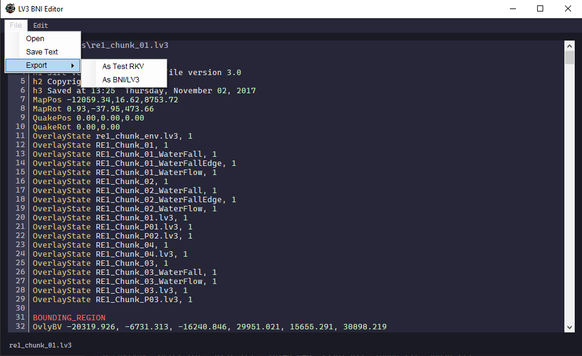
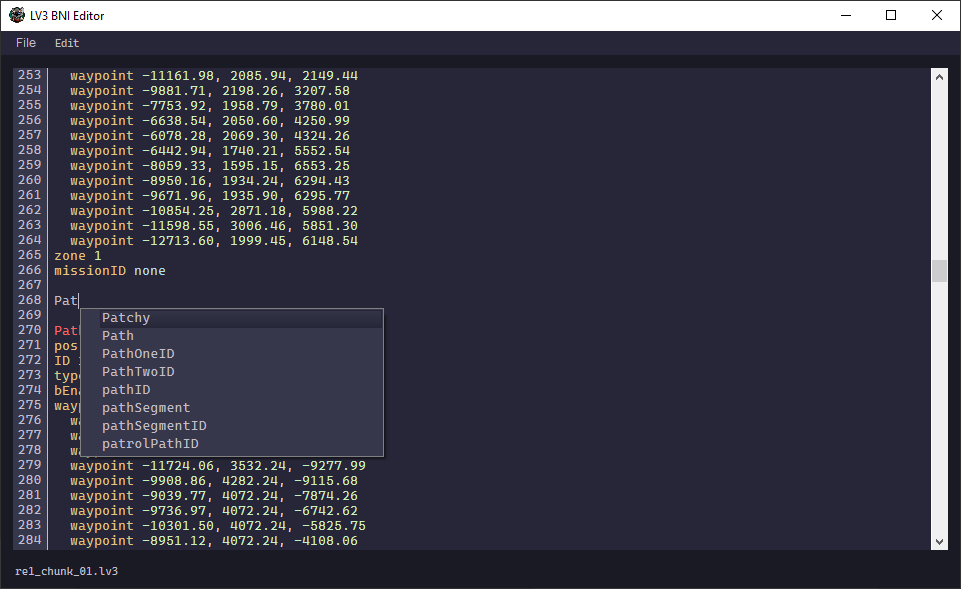
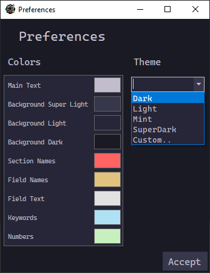
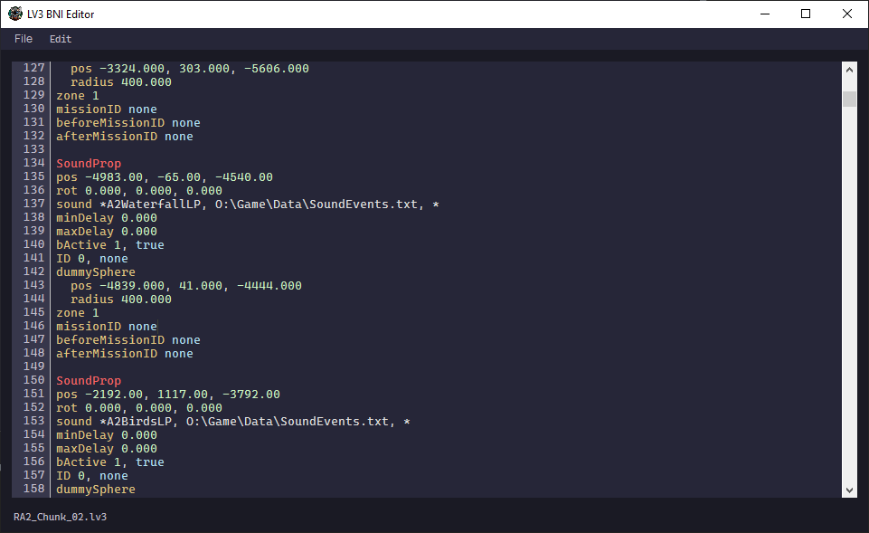
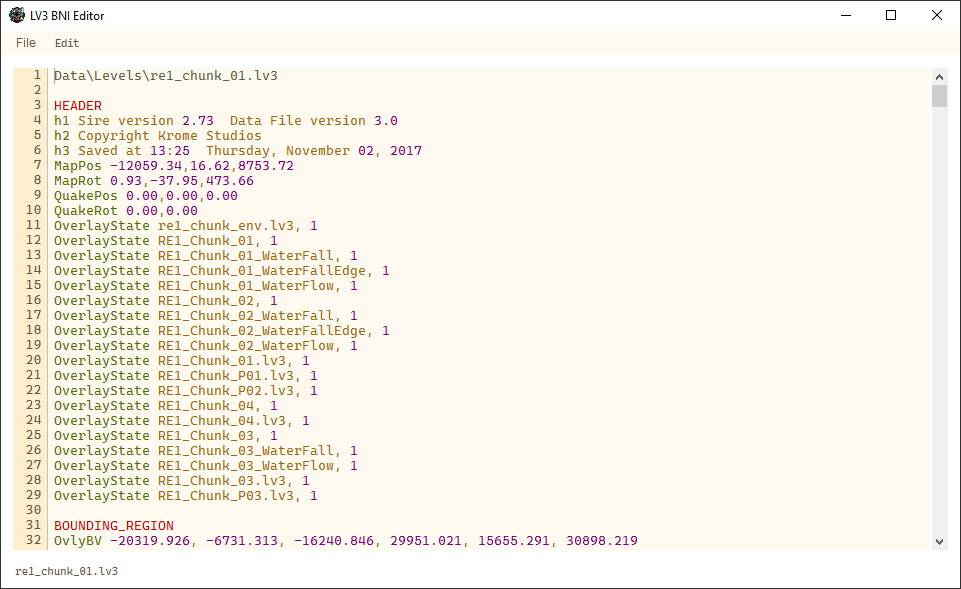
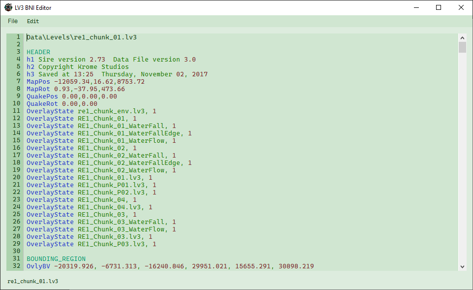
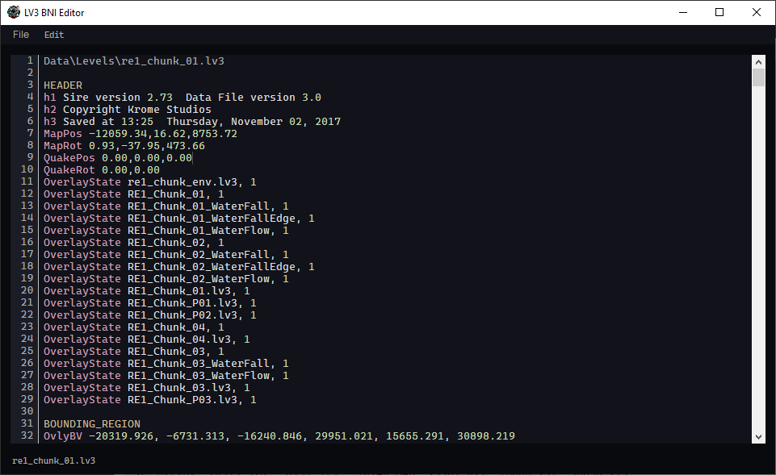

# Krome MK2 LV3 Editor
This app was designed to make modifying the lv3 format easier.
It is a complex format so this converter does not produce an identical file from an unchanged input.
However, the files that are produced are valid and can be loaded by the Krome MK2 engine used for Ty the Tasmanian Tiger 2.

The goal of the app was to convert the MK2 lv3 format into the more readable lv2 format used in the MK1 engine and then convert
the files back to the lv3/bni format used in the MK2 engine.

## Features

### File Loading
Any .txt, .lv3, or .bni file can be loaded into the editor. This means that lv2 files could realistically be converted into lv3 files with some modification.

If a .txt file is opened, the text will be sent directly to the editor window. If a .lv3 or .bni file is opened, the file will be converted to a text format
similar to the .lv2 and then sent to the editor window.

### File Saving
The file must be a valid lv3 format for the save to succeed without crashing or creating a corrupted file. 

There are 3 options when saving a file.

#### Save Text
This will save the text in the editor window to a .txt file to make editing easy and fast in the future.

#### Export As LV3/BNI
This will compile the text in the editor window into a .lv3 or .bni file (depending on the file extension you choose).

Note that the .lv3 and .bni formats are identical but for the game to load the file it must have the extension .bni

This save option should primarily be used for collating completed edits for multiple files ready for repacking them into a .rkv.

#### Export As Test RKV
This will compile the text in the editor window into a .lv3.bni file and then repack the file into a .rkv file for testing.

Note that this is a simplified version of the RKV2_Tools repacking tool and does not support multi-file repacking at all.
You will have to export each file individually and then use the RKV2_Tools repacking tool to repack the files into a .rkv file.

### Editing
The editor window is a simple text editor with some extra features to make editing the lv3 format easier.

Firstly, the editor uses syntax highlighting to show the different types of data in the lv3 format.

The lv3s are divided up into sections. Each section represents a game object or data block within the game world.
Each section has a name, some amount of fields, and some amount of sub-sections.
The fields have names and values and the sub-sections can have nested subsections with fields and values.

The syntax highlighting differentiates between
* Normal text
* Section names
* Field Names
* Field Text
* Numbers
* Keywords
Whilst not comprehensive, the syntax highlighting generally does a good job of aiding in
the readability of the format.

The editor also has an autocomplete feature which allows you to see all section and field names
listed across all of the vanilla lv3 files.

### Customization
The editor's color scheme can be completely customized from the preferences menu.

There are 4 default themes but additional themes can be created by manually modifying the colors
and then saving a theme file. 

DO NOT OVERWRITE COLORS.json

Here are the default themes:

Dark:

Light:

Mint:

SuperDark:

## Acknowledgements

This project would not have been possible without the help of the following people:

* Chippy - https://github.com/1superchip for writing the original parsing tool.
* Pavlo Torhashov - https://github.com/PavelTorgashov for FCTB used in the editor.
* Reza Aghaei - https://www.reza-aghaei.com for [this](https://stackoverflow.com/questions/65976232/how-to-change-the-combobox-dropdown-button-color/65976649#65976649) answer on SO